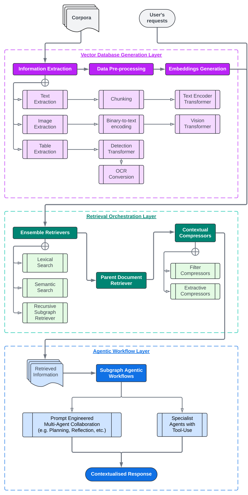

# **SIERRA ⛰️ Semantic Information Encoding, Retrieval, and Reasoning Agents**

This is a proof-of-concept repo detailing an agentic retrieval augmented generation (RAG) workflow, where we create entire teams of AI agents to run a specific and typically complex, domain-specific series of tasks. It consists of three general components:
1. **Vector Database Generation Layer**: This layer is responsible for the extraction and, where possible, creation of a vectorised representation of the data. It involves the conversion of raw data into a format that can be efficiently queried and used by AI agents, using transformer encoders to enable rapid and relevant data retrieval.
2. **Retrieval Orchestration Layer**: This layer manages the retrieval process, orchestrating the interaction between the vector database and the AI agents. It ensures that the most relevant data is fetched from the vector database based on the specific needs of the task, ensuring a multi-search and filteration strategy for highest retrieval accuracy.
3. **Agentic Workflow Layer**: This layer oversees the execution of domain-specific tasks by coordinating multiple AI agents. It defines the workflow, allocates tasks to different agents, and integrates their outputs to achieve the desired outcome. This layer ensures that the agents work collaboratively to handle complex tasks in a structured and efficient manner.

## Getting Started
The code is written using Python 3.11.9 and requires the following packages to be installed:
* `langchain`
* `langchain-community`
* `langchain-groq`
* `langgraph`
* `pygraphviz`
* `pymupdf`
* `python-dotenv`
* `sentence-transformers`
* `torch`
* `tqdm`

## Contact
Feel free to reach out to me at [adam.b.muhtar@gmail.com](mailto:adam.b.muhtar@gmail.com) should you have any questions or issues with running the script.

Thank you and have a great day!